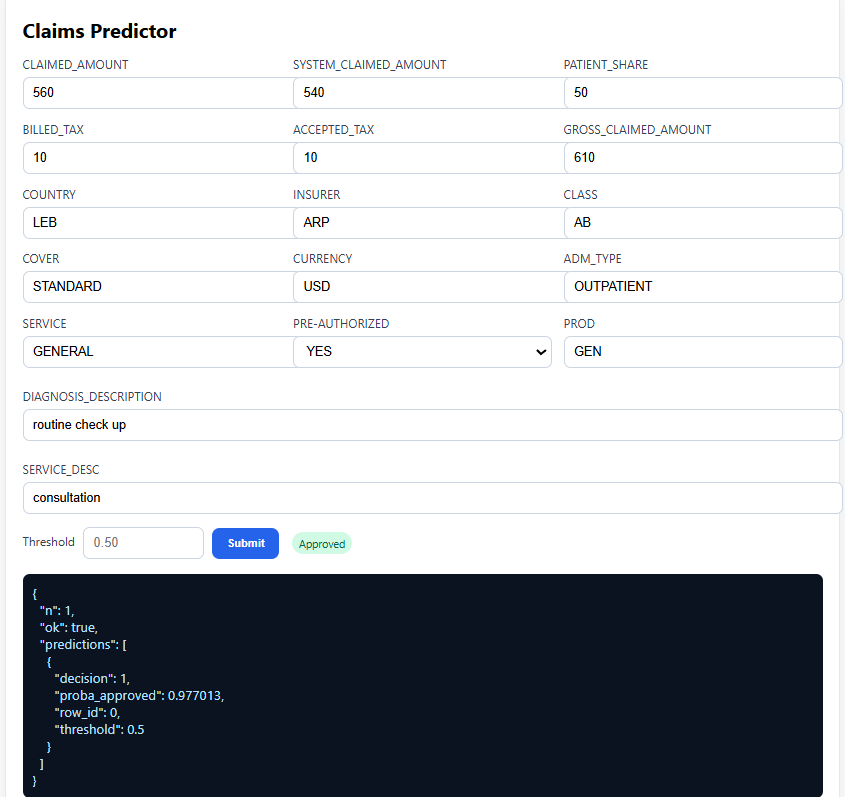
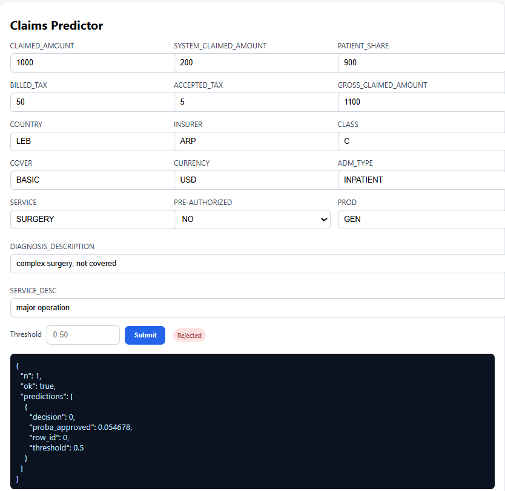

# Intelligent Claim Approval Engine

This project is an **AI-powered API** that predicts whether an insurance claim should be **approved** or **rejected**.  
It was developed, containerized, and deployed end-to-end:

## Notebook Phase
-  Data preprocessing, feature engineering, XGBoost model training & evaluation  
- **Flask API** - REST API + web form for predictions  
- **Docker** - Containerized with Gunicorn for production readiness  
- **Deployment** - Live on Hugging Face Spaces  

 **Live App:** [mty2025-claims-approval-api.hf.space](https://mty2025-claims-approval-api.hf.space)  
 **Space Repo:** [Hugging Face Space](https://huggingface.co/spaces/MTY2025/claims-approval-api)

---

## Features
- REST API with `/predict`, `/health`, `/metadata` endpoints  
- Simple web UI at `/web` for manual testing  
- Containerized using Docker + Gunicorn  
- Deployed on Hugging Face Spaces  

---

## Model Performance
- **ROC-AUC:** 0.9779  
- **PR-AUC:** 0.9867  
- **Brier score:** 0.0582  

**Operating threshold = 0.50**  
- Precision: 0.924  
- Recall: 0.947  
- Specificity: 0.869  
- F1-score: ~0.935  

---

## API Usage

### 1. Health Check
```bash
curl https://mty2025-claims-approval-api.hf.space/health
```
### 2. Metadata:
```bash
curl https://mty2025-claims-approval-api.hf.space/metadata
```
### 3. Predict:
```bash
curl -X POST https://mty2025-claims-approval-api.hf.space/predict \
  -H "Content-Type: application/json" \
  -d '{"CLAIMED_AMOUNT":560,"SYSTEM_CLAIMED_AMOUNT":540,"PATIENT_SHARE":50,
       "BILLED_TAX":10,"ACCEPTED_TAX":10,"GROSS_CLAIMED_AMOUNT":610,
       "COUNTRY":"LEB","INSURER":"ARP","CLASS":"AB","COVER":"STANDARD",
       "CURRENCY":"USD","ADM_TYPE":"OUTPATIENT","SERVICE":"GENERAL",
       "PRE-AUTHORIZED":"YES","PROD":"GEN",
       "DIAGNOSIS_DESCRIPTION":"routine check up","SERVICE_DESC":"consultation"}'
```
Response:
```json 
{"decision": 1, "proba_approved": 0.92, "threshold": 0.5}
```
### 4. Example Cases
### Approved Claim
```json
{"CLAIMED_AMOUNT":560,"SYSTEM_CLAIMED_AMOUNT":540,"PATIENT_SHARE":50,
 "BILLED_TAX":10,"ACCEPTED_TAX":10,"GROSS_CLAIMED_AMOUNT":610,
 "COUNTRY":"LEB","INSURER":"ARP","CLASS":"AB","COVER":"STANDARD",
 "CURRENCY":"USD","ADM_TYPE":"OUTPATIENT","SERVICE":"GENERAL",
 "PRE-AUTHORIZED":"YES","PROD":"GEN",
 "DIAGNOSIS_DESCRIPTION":"routine check up","SERVICE_DESC":"consultation"}
```
Decision: Approved (1)

### Rejected Claim
```json
{"CLAIMED_AMOUNT":1000,"SYSTEM_CLAIMED_AMOUNT":200,"PATIENT_SHARE":900,
 "BILLED_TAX":50,"ACCEPTED_TAX":5,"GROSS_CLAIMED_AMOUNT":1100,
 "COUNTRY":"LEB","INSURER":"ARP","CLASS":"C","COVER":"BASIC",
 "CURRENCY":"USD","ADM_TYPE":"INPATIENT","SERVICE":"SURGERY",
 "PRE-AUTHORIZED":"NO","PROD":"GEN",
 "DIAGNOSIS_DESCRIPTION":"complex surgery, not covered",
 "SERVICE_DESC":"major operation"}
```
Decision: Rejected (0)

### Screenshots



### 5. Run Locally with Docker:
```json
docker build -t claims-api .
docker run --name claims-api -d -p 7860:7860 claims-api

```
### 6. Then open http://127.0.0.1:7860/web

### 7. Project Workflow
Notebook -> preprocess data, train + evaluate model

Flask -> create API endpoints

Docker ->  containerize with Gunicorn server

Deploy -> launch live Hugging Face Space


### 8. License
MIT License – free to use and modify.

